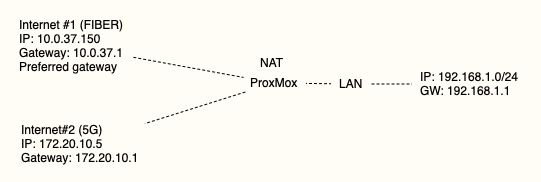

# proxmox-failover-network
A way to have ProxMox failover between two (Internet facing) network interfaces on different ISP's.

## Assumptions
- You have a ProxMox-server with 2 Internet-facing network interfaces and one or nmore LAN-interfaces.
- The Internet-facing interfaces are ens160 and ens192 and both interfaces are configured to use DHCP.
- You know your way around the Linux commandline (Shell).
- Schema:

  

  In this case the DHCP-servers provided these IP-addresses:
  ```
  ens160: 10.0.37.150 / 255.255.255.0 with default gateway 10.0.37.1
  ens192: 172.20.10.5 / 255.255.255.0 with default gateway 172.20.10.1
  ```

## Confirmed working versions
- Proxmox PVE 8.2.2

## Instructions

### Networkinterfaces

- Edit `/etc/network/interfaces`  and configure both Internet-facing interfaces for use with DHCP:

```
auto ens160
iface ens160 inet dhcp

auto ens192
iface ens192 inet dhcp
```

- Ensure these interfaces are NOT part of any other bridge, bond, vlan
- Reinitialize the network using the command `systemctl restart networking.service`


### KeepaliveD

- Install keepalived

  ```bash
  apt install keepalived -y
  ```

- Create/Edit `/etc/keepalived/keepalived.conf`like this:

  ```
  global_defs {
      script_user root
      script_security 1
  }
  
  vrrp_script chk_gateway_ens160 {
      script "/etc/keepalived/check_gateway.sh ens160"
      interval 2
      weight 10
  }
  
  vrrp_script chk_gateway_ens192 {
      script "/etc/keepalived/check_gateway.sh ens192"
      interval 2
      weight 5
  }
  
  vrrp_instance VI_1 {
      state MASTER
      interface ens160  # Primary interface to monitor
      virtual_router_id 51
      priority 100
      advert_int 1
  
      track_script {
  	      chk_gateway_ens160
  	      chk_gateway_ens192
      }
  
      notify_master "/etc/keepalived/switch_gateway.sh ens160"
      notify_backup "/etc/keepalived/switch_gateway.sh ens192"
      notify_fault  "/etc/keepalived/switch_gateway.sh ens192"
  }
  ```

  This way interface ens160 will have precendence over ens192. Higher `weight`: more precedence. 
  This can be handy if ens160 is connected via a fiber-connection and ens192 is connected via a 5G-router.

- Create/Edit `/etc/keepalived/check_gateway.sh`like this:
  ``` bash
  #!/bin/bash
  
  # Check if an interface is provided as a parameter
  if [ -z "$1" ]; then
      echo "Usage: $0 <interface>"
      exit 2
  fi
  
  INTERFACE="$1"
  GATEWAY=`grep "routers" /var/lib/dhcp/dhclient.${INTERFACE}.leases | tail -1 | awk {'print $3'} | cut -f1 -d";" `
  echo "Interface ${INTERFACE} has ${GATEWAY} as gateway."
  
  # Perform the ping test
  ping -I "$INTERFACE" -c 1 -W 1 ${GATEWAY} > /dev/null 2>&1
  if [ $? -eq 0 ]; then
      echo "Default gateway ${GATEWAY} reachable"
      exit 0 # Gateway is reachable
  else
      echo "Default gateway ${GATEWAY} unreachable"
      exit 1  # Gateway is unreachable
  fi
  ```

- Create/Edit `/etc/keepalived/switch_gateway.sh` like this:

  ```bash
  #!/bin/bash
  # Check if an interface is provided as a parameter
  if [ -z "$1" ]; then
      echo "Usage: $0 <interface> <ip-address>"
      exit 2
  fi
  
  INTERFACE="$1"
  GATEWAY=`grep "routers" /var/lib/dhcp/dhclient.${INTERFACE}.leases | tail -1 | awk {'print $3'} | cut -f1 -d";" `
  echo "Interface ${INTERFACE} has ${GATEWAY} as gateway."
  
  ip route del default 2>/dev/null
  ip route add default via ${GATEWAY} dev ${INTERFACE}
  ```

- Make both Shell-scripts executable.
  ```bash
  chmod +x /etc/keepalived/*.sh
  ```

  

  #### Testing the scripts

- You can check the scripts manually by running them at the command line:

  ```bash
  /etc/keepalived/check_gateway.sh ens160
  ```

  This should result to output like:

  ```
  Interface ens160 has 10.0.37.1 as gateway.
  Default gateway 10.0.37.1 reachable
  ```

  where 10.0.37.1 will be different in your case.

* Using the command `ip route` to show the current routing table which should result to output like:

  ```
  default via 10.0.37.1 dev ens160 
  10.0.37.0/24 dev ens160 proto kernel scope link src 10.0.37.153 
  172.20.10.0/28 dev ens192 proto kernel scope link src 172.20.10.5 
  ```

  In this case, my first interface ens160 is used as the internet gateway.

* By running the command:
   `/etc/keepalived/switch_gateway.sh ens192` 

  This should result to output like:
  ```Interface ens192 has 172.20.10.1 as gateway.```

* Using the command `ip route` to show the current routing table which should result to output like:
  ``` 
  default via 172.20.10.1 dev ens192 
  10.0.37.0/24 dev ens160 proto kernel scope link src 10.0.37.153 
  172.20.10.0/28 dev ens192 proto kernel scope link src 172.20.10.5
  ```


#### Activate keepalived

* Run these commands:

  ```bash
  systemctl enable keepalived
  systemctl start keepalived
  ```

* Check the logs using this command:
  ```journalctl -u keepalived```


